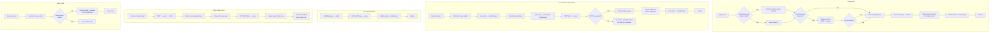

# State Persistence Flow

```mermaid
flowchart TD
    subgraph LOAD["Page Load"]
        A[App opens] --> B{localStorage has<br/>today's state?}
        B -- Yes --> C[Restore state & render instantly]
        B -- No --> D[Show loading...]
        C --> E{Pending queue<br/>has ops?}
        D --> E
        E -- Yes --> F[Replay each op<br/>POST → server]
        E -- No --> H
        F --> G{All succeeded?}
        G -- Yes --> H[Clear pending queue]
        G -- No --> H
        H --> I[GET fetchToday → server]
        I --> J[Server queries Notion<br/>for today's date]
        J --> K[Update state + localStorage]
        K --> L[Render]
    end

    subgraph CLICK["User Clicks a Habit Button"]
        M[Button pressed] --> N[Optimistic state update]
        N --> O[Save state → localStorage]
        O --> P[Render immediately]
        P --> Q[Queue op → pending in localStorage]
        Q --> R[POST track → server]
        R --> S{POST succeeded?}
        S -- Yes --> T[Clear pending queue]
        T --> U[Update state from<br/>server response]
        U --> V[Save state → localStorage]
        V --> W[Render]
        S -- No --> X[Op stays in pending queue<br/>will retry on next load]
    end

    subgraph RESUME["Tab / App Resume"]
        Y[visibilitychange → visible] --> Z[GET fetchToday → server]
        Z --> AA[Update state + localStorage]
        AA --> AB[Render]
    end

    subgraph CROSS["Cross-Device Sync"]
        CA[Device A: tracks habit] --> CB[POST → server → Notion]
        CB --> CC[Notion stores updated row]
        CC --> CD[Device B: opens app]
        CD --> CE[GET fetchToday → server]
        CE --> CF[Server reads Notion row]
        CF --> CG[Device B renders<br/>up-to-date state]
    end

    subgraph FLUSH["Daily Flush"]
        DA[New day starts] --> DB[loadState checks date]
        DB --> DC{Stored date =<br/>today?}
        DC -- No --> DD[Remove state + pending<br/>from localStorage]
        DD --> DE[Fresh start]
        DC -- Yes --> DF[Use cached state]
    end
```
